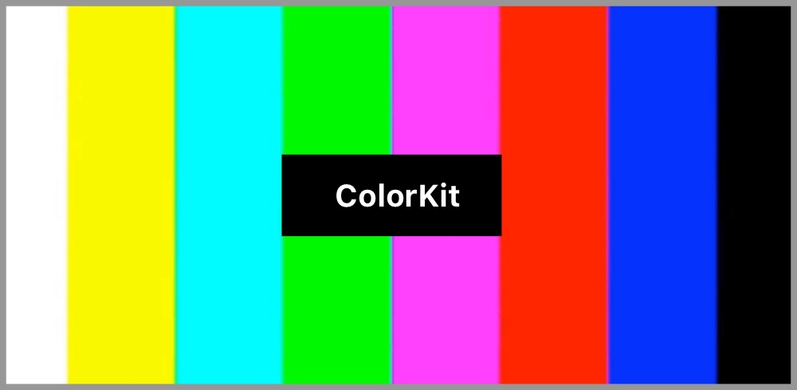
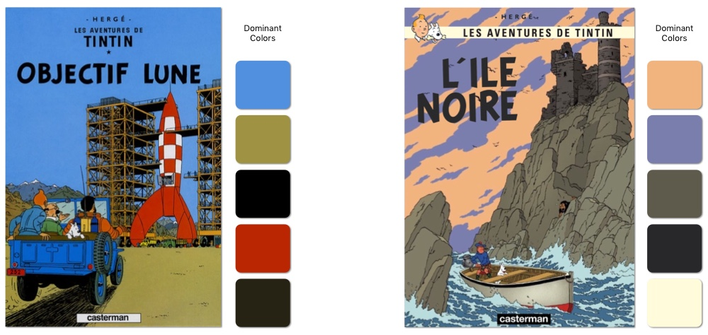
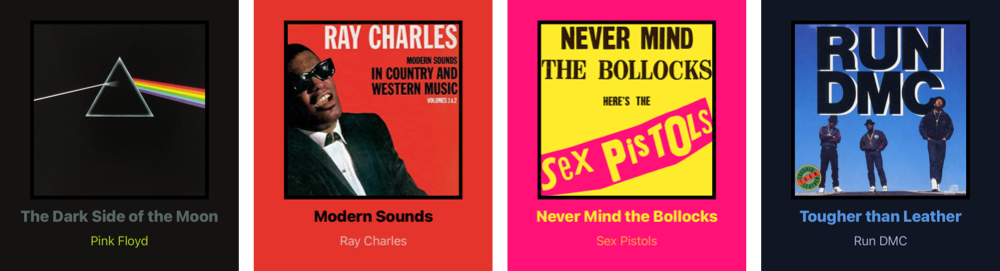

# ColorKit

<p align="center"></p>

**ColorKit** is your companion to work with colors on iOS.

<p align="center">
    <a href="LICENSE">
        
    </a>
    <a href="LICENSE">
        
    </a>
    <a href="https://swift.org">
        
    </a>
</p>

- [Features](#features)
- [Installation](#installation)
- [Sample Project](#sample-project)
- [Contributing](#contributing)
- [License](#license)

</br>

## Features

### Dominant Colors
**ColorKit** makes it easy to find the dominant colors of an image. It returns a color palette of the most common colors on the image.

```swift
let dominantColors = try image.dominantColors()
```

<p align="center">
    
</p>

By default, **ColorKit** uses an iterative process to determine the dominant colors of an image. But it also supports doing so via a [k-mean clustering algorithm](https://en.wikipedia.org/wiki/K-means_clustering). Choose whichever is more appropriate for your use case.

---

### Color Palette
**ColorKit** lets you generate color palettes from a collection of colors. It will automatically ensure that the best colors are picked based on a few configurable parameters like contrast ratio.  
This feature is particularly powerful when combined with the dominant color calculation.

```swift
let colors = try image.dominantColors()
let palette = ColorPalette(orderedColors: colors, ignoreContrastRatio: true)
```
The following examples use the palette to dynamically match the color of the text and background to the album covers.

<p align="center">
    
</p>

---

### Average Color

To compute the average color of an image, simply call the `averageColor` function on a `UIImage` instance.
```swift
let averageColor = try image.averageColor()
```

---

### Color Difference (DeltaE)

Perceptual color difference / comparaison is a common problem of color science.  
It simply consists of calculating how different two colors look from each other, to the human eye. This is commonly referenced as the DeltaE.

**ColorKit** makes it a breaze to compare two colors.

```swift
let colorDifference = UIColor.green.difference(from: .white) // 120.34
```

While this may seem trivial, simply using the RGB color model often yields non-accurate results for human perception.
This is because RGB is not perceptually uniform.

Here is an example highlighting the limitations of using the RGB color model to compare colors.

<p align="center">
    
</p>

As you can see, the difference between the two greens (left) is considered greater than the difference between the pink and gray colors (right). In other words, the pink and gray are considered to look more similar than the two greens.  
This obviously does not match the expectation of the human eye.

Thankfully, **ColorKit** provides algorithms that make it possible to compare colors just like the human eye would: **CIE76**, **CIE94** and **CIEDE2000**.

```swift
let colorDifference = UIColor.green.difference(from: .white, using: .CIE94) 
```

Here is the same example as above, using the **CIE94** algorithm.

<p align="center">
    
</p>

The **CIE94** algorithm successfuly realizes that the two greens (left) look closer from each other than the pink and gray (right) do.

More information about color difference can be found [here](https://en.wikipedia.org/wiki/Color_difference).

---

### Contrast Ratio

To calculate the contrast ratio between two colors, simply use the `contrastRatio` function.
```swift
let contrastRatio = UIColor.green.contrastRatio(with: UIColor.white)
```
The contrast ratio is particularly important when displaying text.
To ensure that it's readable by everyone, **ColorKit** makes it easy for you to follow the accessibility guidelines set by [WCAG 2](https://www.w3.org/WAI/WCAG21/quickref/?versions=2.0#qr-visual-audio-contrast-contrast).

---

### Color Space Conversions

**ColorKit** assists you when translating a color from a color space to another.
They're simply supported as extensions on `UIColor`.  
**CIELAB**, **XYZ** and **CMYK** are supported.

---

### More

There is a lot more that **ColorKit** is capable of.
Here is a short list of examples:
- Working with Hex color codes
```swift
let hexValue = UIColor.green.hex
let color = UIColor(hex: "eb4034")
```
- Generating random colors
```swift
let randomColor = UIColor.random()
```
- Calculating the relative luminance of a color
```swift
let relativeLuminance = UIColor.green.relativeLuminance
```
- Generating complementary colors
```swift
let complementaryColor = UIColor.green.complementaryColor
```

</br>

## Installation

### Swift Package Manager

The [Swift Package Manager](https://swift.org/package-manager/) is the easiest way to install and manage **ColorKit** as a dependecy.  
Simply add **ColorKit** to your dependencies in your `Package.swift` file:
```swift
dependencies: [
    .package(url: "https://github.com/Boris-Em/ColorKit.git")
]
```

Alternatively, you can also use XCode to add **ColorKit** to your existing project, by using `File > Swift Packages > Add Package Dependency...`.

### Manually

**ColorKit** can also be added to your project manually. Download the **ColorKit** project from Github, then drag and drop the folder `ColorKit/ColorKit` into your XCode project.

</br>

## Sample Project

Use the iOS sample project included in this repository to find comprehensive examples of the different features of **ColorKit**.

</br>

## Contributing

Contributions to **ColorKit** are always welcome!   
For bugs and feature requests, open an [issue](https://github.com/Boris-Em/ColorKit/issues/new).  
To contribute to the code base, simply submit a [pull request](https://github.com/Boris-Em/ColorKit/pulls).

</br>

## License

See the [License](https://github.com/Boris-Em/ColorKit/blob/master/LICENSE). You are free to make changes and use this in either personal or commercial projects. Attribution is not required, but highly appreciated. A little "Thanks!" (or something to that affect) is always welcome. If you use **ColorKit** in one of your projects, please let us know!
