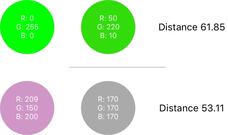

# ColorKit

**ColorKit** is your companion to work with colors on iOS.

- [Features](#features)
- [Installation](#installation)
- [Contributin](#contributin)
- [License](#license)

## Features

### Color Difference

**ColorKit** makes it a breaze to compare how close two colors look from each other.

```swift
let colorDifference = UIColor.black.difference(from: .white) 
// Opposite
```

While this may seem trivial, simply using the RGB color model often yields non-accurate results for human perception.
This is because RGB is not perceptually uniform.

Here is an example highlighting the limitations of using the RGB color model to compare colors.

<p align="center">
    
</p>

As you can see, the difference between the two greens (top) is considered greater than the distance between the pink and gray (bottom).   
This obiously does not match the expectation of the human eye.

Thankfully, **ColorKit** provides algorithms that make it possible to compare colors just like the human eye would: **CIE76** and **CIE94**.

```swift
let colorDifference = UIColor.black.difference(from: .white, using: .CIE94) 
```

More information about color difference can be found [here](https://en.wikipedia.org/wiki/Color_difference).

### Dominant Colors
**ColorKit** makes it easy to find the dominant colors of an image. It returns a color palette of the most common colors on the image.

```swift
let dominantColors = image.dominantColors()
```

<p align="center">
    
</p>

### Average Color